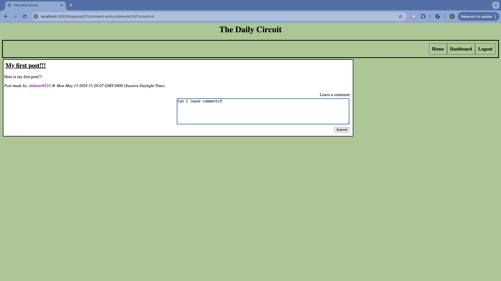

# The Daily Circuit

## 

## Description

This is a back-end application for a tech blog site. This app will allow users to create an account, log in, create blog posts, and comment on others' blog posts. Guest users can view posts and comments.

The app uses MVC architecture. The Handlebars.js templating engine takes care of the "views" component, dynamically rendering different views for the user, and Sequelize takes care of the "model" component, retrieving, saving, updating, and deleting data from an SQL database.

I learned/practiced the following technologies/skills/concepts through the development of this application:

### Technologies

- Express.js (web app framework)
- Sequelize (ORM)
- Handlebars.js
- MySQL
- dotenv (npm package)
- express-handlebars (npm package)
- bcryptjs (npm package)
- express-session (npm package)
- connect-session-sequelize (npm package)
- mysql2 (npm package)
- Heroku (for deployment)
- JAWS DB (for remote MySQL)

### Skills/Concepts

- ORM implementation: building models to create MySQL tables/ table relationships
- RESTful routing
- One-to-many table relationships
- Asynchronicity: async/await functions
- MVC architecture
- Handlebars.js
- Deploying an app that must connect to a remote MySQL database

## Table of Contents

- [Installation](#installation)
- [Usage](#usage)
- [Contributions](#contributions)
- [License](#license)

## Installation

Visit the deployed app here: https://daniel-tech-blog-5cc96a923f6f.herokuapp.com/

## Usage

Homepage view:

Dashboard (not logged in):

View post & comments (not logged in):

Login page:

Leaving a comment:

Comment created:

Creating a post:

Post created:

Creating a new user:

## License

This application is covered under the [MIT](https://opensource.org/licenses/MIT) license.

## Contributions

Resolved a heroku deployment issue with the help from this post:
https://stackoverflow.com/questions/52287669/nodejs-bcrypt-heroku-fail-deploy

## Tests

No tests used for the development of this app!

## Questions

Any Questions? Click a link below to visit my GitHub and/or email me!

For emails, please use this format in the subject line: 'GitHub: {NAME_OF_REPOSITORY}'

[GitHub](https://github.com/danrcross)

[Email](mailto:danrcross@gmail.com)
